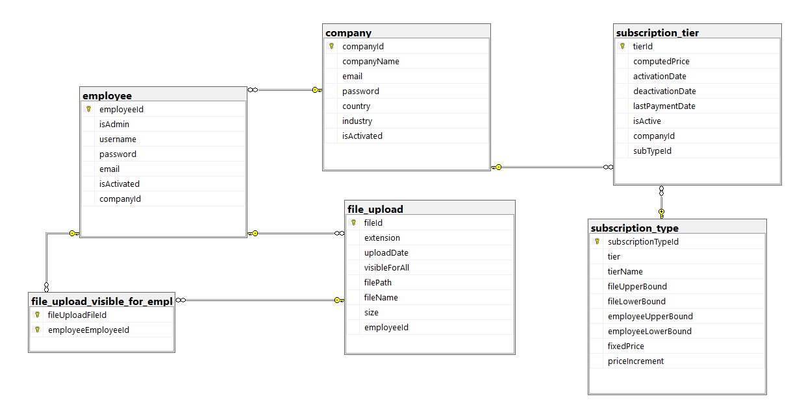

Technical assignment source code for **_Making Science | Sweeft Acceleration Program / Node js. Task_**

App uses `mssql `and `typeorm`, syncs automatically with db called `Sweeft` with collation `SQL_Latin1_General_CP1_CS_AS`

Then test api from [Postamn workspace](https://www.postman.com/winter-eclipse-230888/workspace/sweeft) . (All necessary explanations are in postman docs as well as in `http.rest` file)

**How to run app from docker**

-   after compilation make sure dist includes /templates folder (idk ts missing that in process )
-   `docker-compose up`
-   enter sql server and create db (specified name in .env)
-   restart sweeft-app container
-   all done

## **Database diagram**

